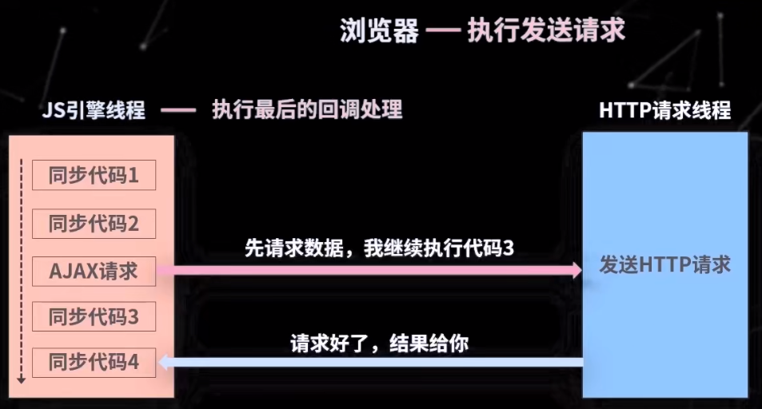
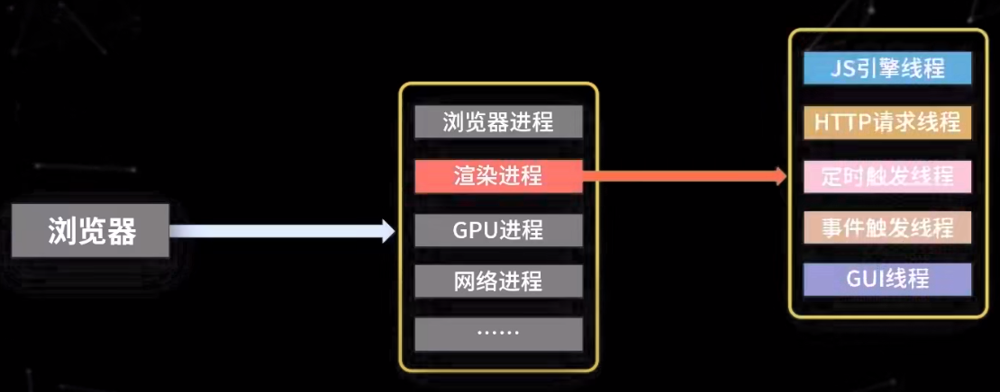
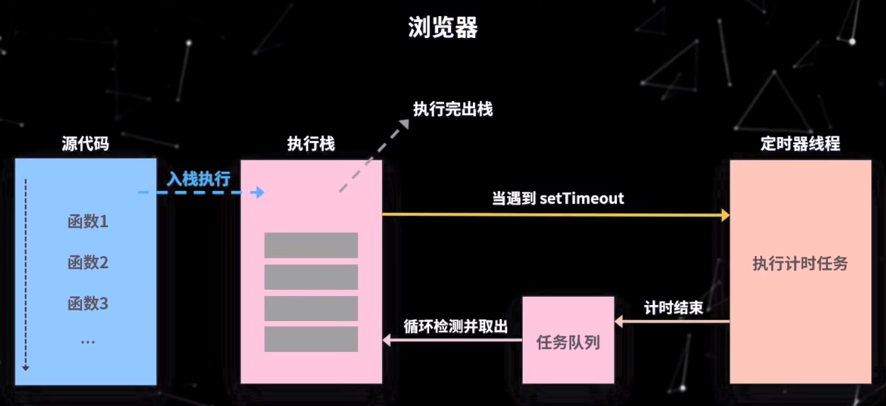
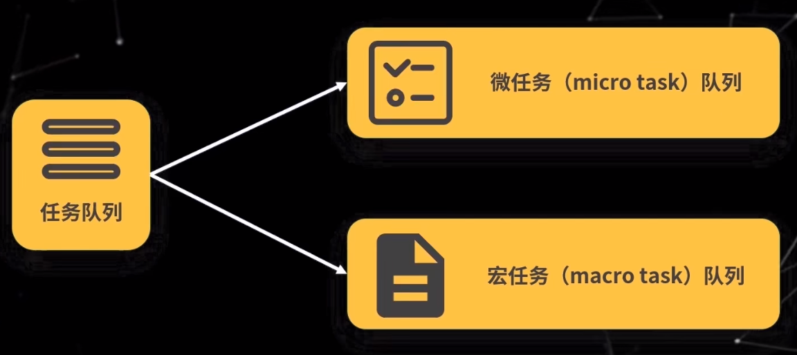
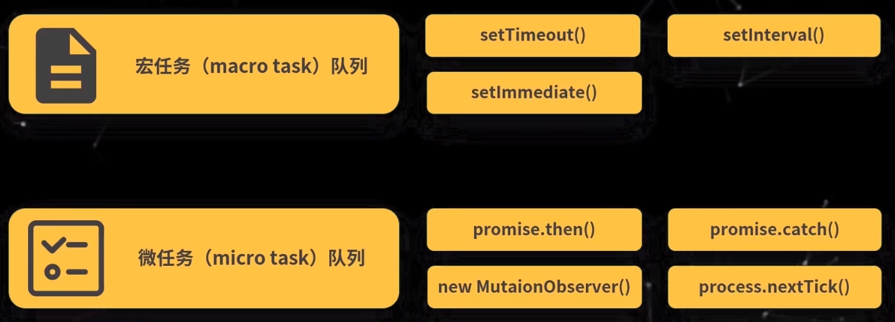
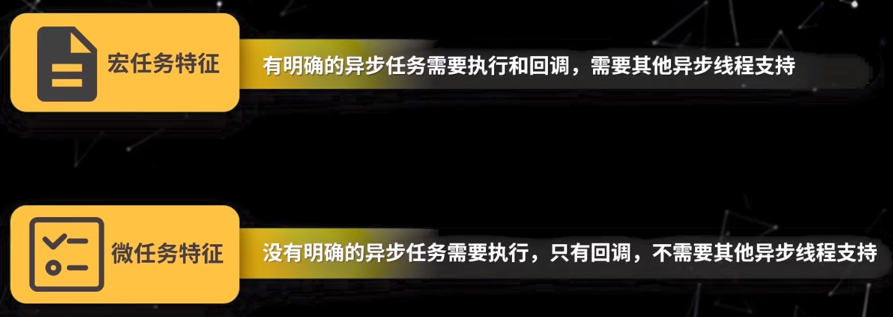
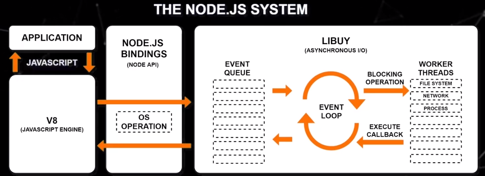
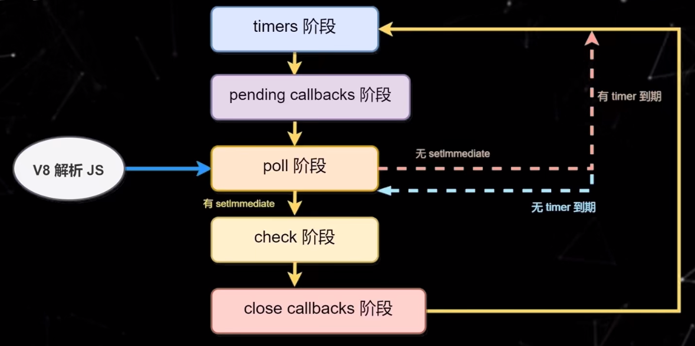

# Node.js

1. 事件循环
2. 垃圾回收
3. 模块化
4. fs
5. process
6. path
7. buffer
8. vm
9. events

## 1. 事件循环

### 1.1 浏览器JS异步执行原理

浏览器线程执行发送请求，JS引擎线程执行最后的回调处理

每个tab标签页都是一个渲染进程，所以一个页面崩溃，其他页面不会崩溃

### 1.2 浏览器中的事件循环

浏览器中JS代码执行流程（事件循环过程），每一次循环都是一次事件周期`tick`

一次循环，先检测微任务队列是否有任务，再检测宏任务队列

微任务队列只有一个，宏任务队列有多个，比如：定时器任务，请求任务，键盘鼠标操作。。。

>setTimeout 0 在浏览器中是4ms，在Node中是1ms

>new Promise 参数回调中是同步的

### 1.3 Node.js中的事件循环

libuv库

事件循环流程

+ `timers`：执行`setTimeout`和`setInterval`中到期的callback
+ `pending callbacks`：上一轮循环中有少数的 I/O callback 会被延迟到这一轮的这一阶段执行
+ `idle, prepare`：~~仅内部使用。~~
+ `poll`：最为重要的阶段，执行 I/O callback，在适当的条件下会阻塞在这个阶段
+ `check`：执行`setImmediate`的callback
+ `close callbacks`：执行close事件的callback，例如`socket.on("close",func)`

## 2. 垃圾回收

## 3. 模块化

## 4. fs
